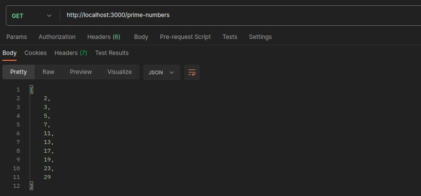

<strong><h1 align="center">Prime Numbers</h1></strong>
<p align="center"><strong>Project developed for a technical challenge/test</strong></p>

<p align="center">
  
</p>

## 🚀 Challenge
Write a function that checks whether a number is prime or not. Then create a program that
prints the first 10 prime numbers.

## 🛰️ Technologies
This project was developed with the following technologies:

- Node.js
- Express
- Jest
## 💻 Installation / How to use
- Clone this repository:
   ```bash
   git clone https://github.com/jairokoning/prime-numbers-api.git
   ```
- Install dependencies:
   ```bash
   yarn install
   ```
- Start the application
   ```bash
   yarn dev
   ```
- Run tests
   ```bash
   yarn test
   ```
- Execute http://localhost:3000/prime-numbers on a API Client for REST (Insomnia, Postman...)
---

_Developed with_ 😀 _and_ ❤️ _by [Jairo Koning](https://linkedin/in/jairokoning)_